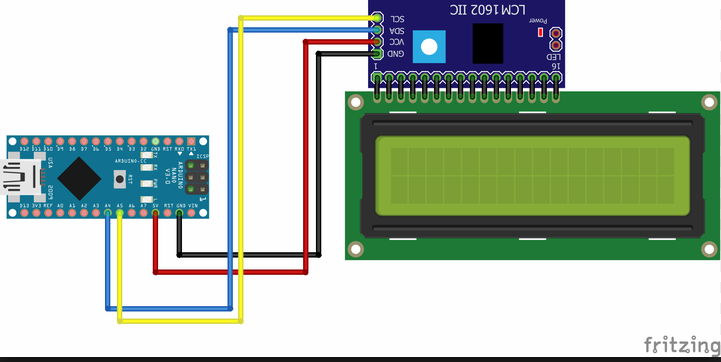
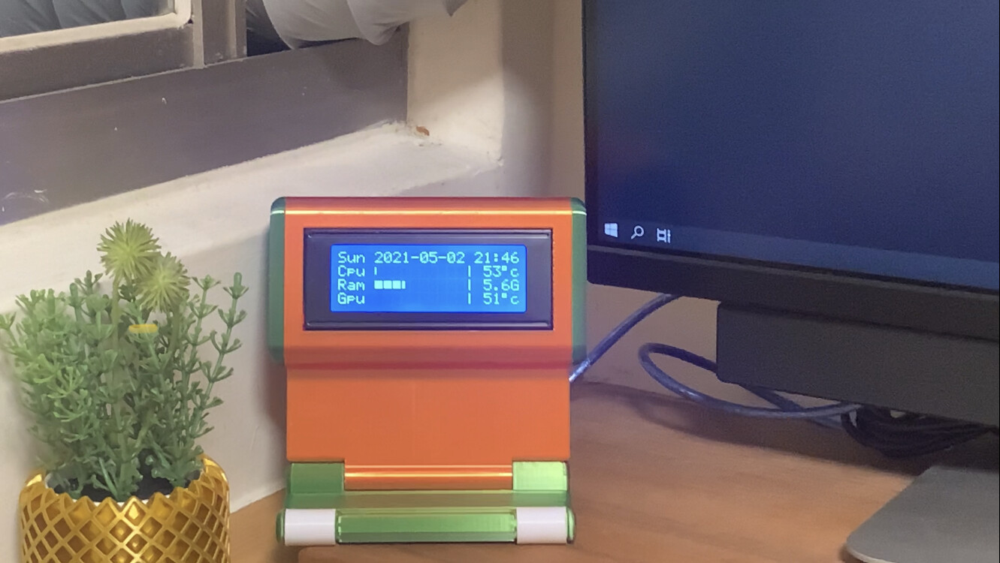
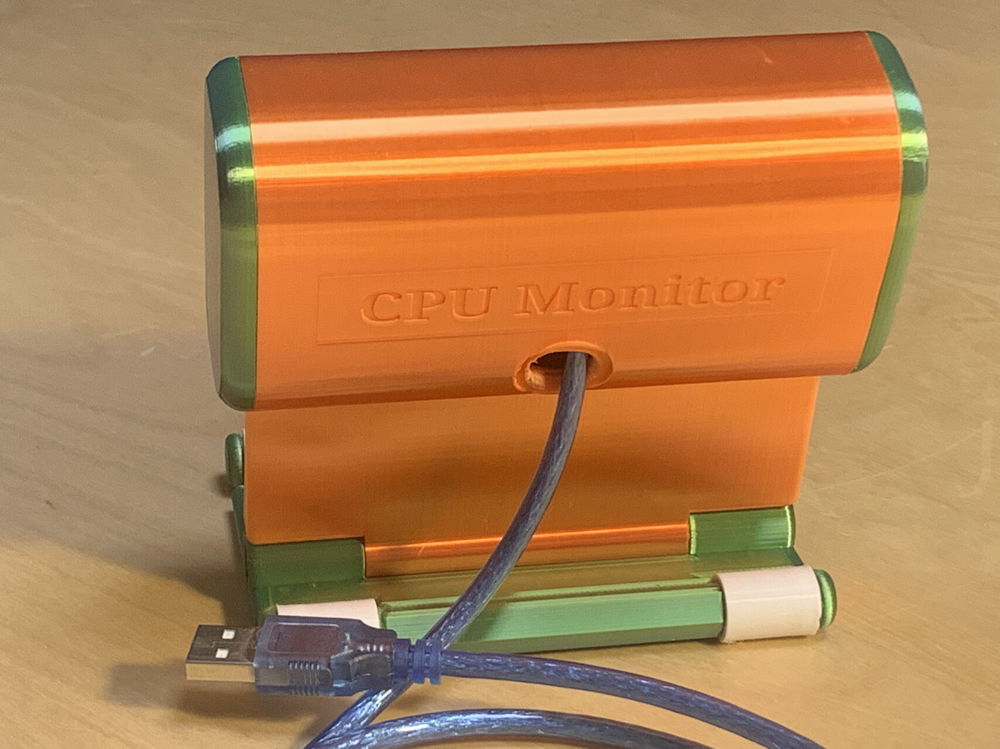
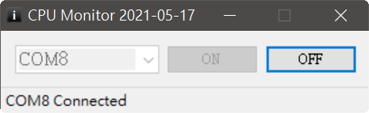
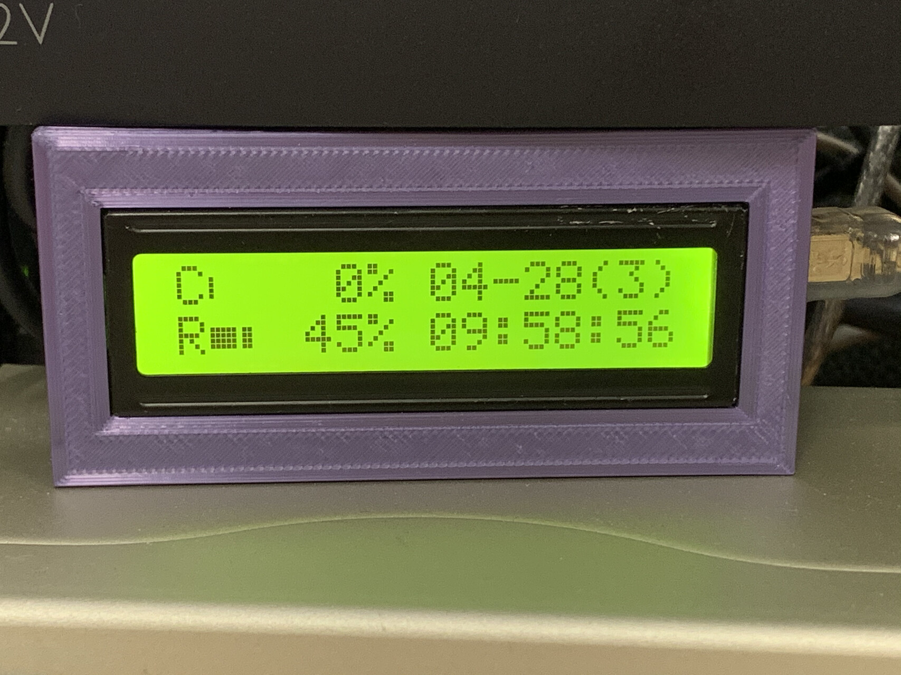
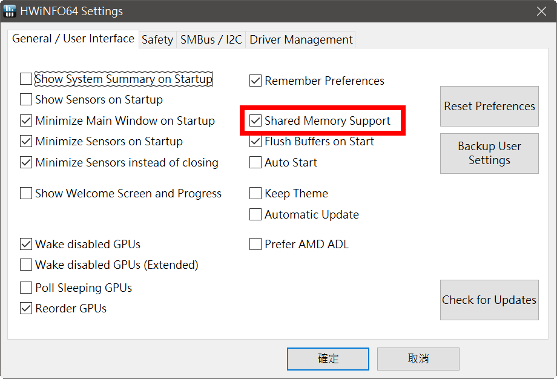
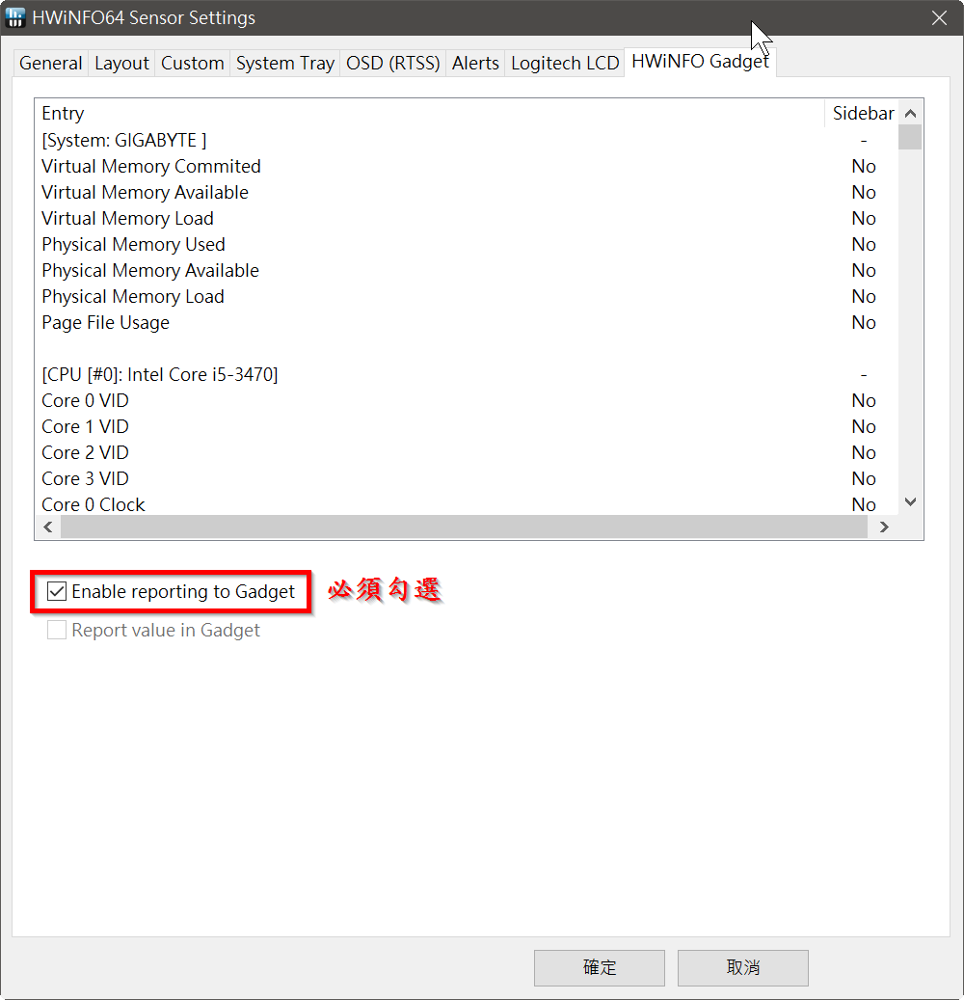

# Arduino_Pc_Monitor (電腦資源監視器)

這是一個基於 Arduino 與 C# 的電腦資源監控專案，透過外接 LCD 螢幕即時顯示 PC 的硬體狀態。
系統採用 Master-Slave 架構，必須在 PC 端執行一個常駐程式以傳送數據。

## 版本說明
本專案提供兩個版本，分別針對不同的需求與硬體配置：

### 1. OpenInfo_LCD (使用 LCD1602)
   (1) OpenInfo_LCD_C#: C# 原始碼 (.net 4.0)  
   (2) OpenHardwareMonitorLCD.exe: 已Compile的執行檔  
   (3) OpenHardwareMonitorLib.dll: 必須與執行檔放在相同目錄  
   (4) OpenInfo_LCD_Arduino: Arduino 原始碼  
   (5) 硬體材料: Arduino Nano, LCD1602(I2C)  
   (6) 3D列印外殼: https://www.thingiverse.com/thing:3350530  
  
### 2. HWiNFO_LCD (使用 LCD2004)
   (1) HWiNFO_LCD_C#: C# 原始碼 (.net 4.0)  
   (2) HWiNFO_LCD.exe: 已Compile的執行檔  
   (3) 必須安裝 HWiNFO，官方網站: https://www.hwinfo.com/  
   (4) 在 HWiNFO Settings 中，勾選 Shared Memory Support  
   (5) 在 HWiNFO Sensor Settings 中，勾選 Enable reporting Gadget  
   (6) HWiNFO_LCD_Arduino: Arduino 原始碼  
   (7) 硬體材料: Arduino Nano, LCD2004(I2C)  
   (8) 3D列印外殼: https://www.thingiverse.com/thing:4171171  

## 成果展示

  
  

